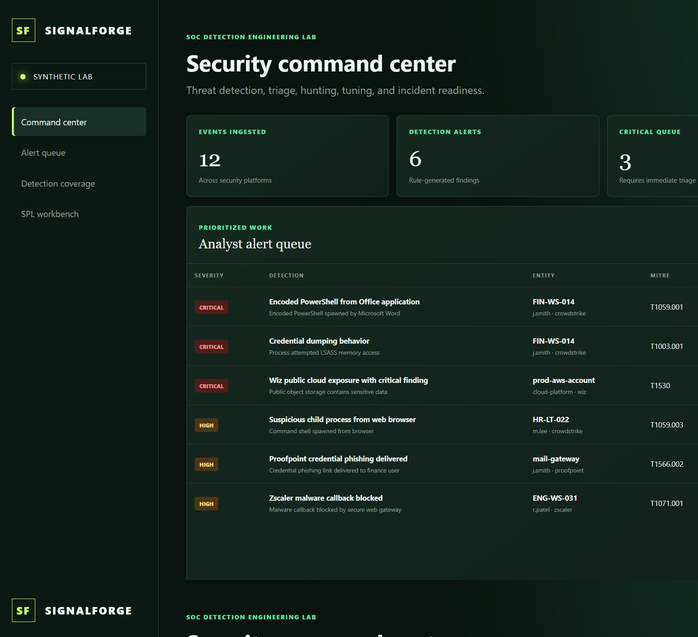

# SignalForge SOC Detection Engineering Lab

> A Docker-based blue-team portfolio project for advanced SOC triage, threat hunting, detection engineering, alert tuning, and incident reporting.

[](https://github.com/JoelMAnglin/soc-detection-engineering-lab/actions/workflows/ci.yml)
[](LICENSE)
[](docs/CROWDSTRIKE_VALIDATION.md)



## Why this project exists

This lab maps directly to senior SOC analyst responsibilities:

- advanced alert triage and incident reporting;
- complex Splunk Core/ES SPL searches and threat hunts;
- CrowdStrike Falcon- and Proofpoint-shaped telemetry analysis;
- Wiz and Zscaler context enrichment;
- detection content, tuning, log management, and automation;
- Python and PowerShell analyst tooling;
- safe AI-assisted workflow design with human validation.

It runs locally with open-source components and requires no API keys, paid services, cloud resources, or commercial licenses.

## Important validation boundary

CrowdStrike, Proofpoint, Wiz, and Zscaler records are **synthetic, schema-shaped lab events**. The automated tests validate the adapter assumptions, field mappings, detection logic, alert creation, and dashboard rendering. They do not claim a connection to or certification by any commercial vendor. See [CrowdStrike validation](docs/CROWDSTRIKE_VALIDATION.md).

## Quick start

Prerequisites: [Docker Desktop](https://www.docker.com/products/docker-desktop/) and Git.

```bash
git clone https://github.com/JoelMAnglin/soc-detection-engineering-lab.git
cd soc-detection-engineering-lab
docker compose up --build --wait
python scripts/validate_lab.py
```

Open [http://localhost:8080](http://localhost:8080).

Stop and remove the lab:

```bash
docker compose down -v
```

The `-v` removes only this lab's named database volume and resets the synthetic dataset.

## What is included

| Capability | Implementation |
|---|---|
| Endpoint telemetry | CrowdStrike Falcon-shaped `ProcessRollup2` and network events |
| Email security | Proofpoint TAP/TRAP-shaped phishing and quarantine events |
| Cloud security | Wiz-shaped critical exposure context |
| Secure web gateway | Zscaler-shaped malware callback events |
| Detection engine | Six versioned Python rules with benign/positive test cases |
| Splunk content | Six detection searches, a threat hunt, and reusable macros |
| SOC dashboard | Alerts, telemetry health, metrics, and MITRE coverage |
| Automation | Python validation and PowerShell incident export |
| CI/CD | GitHub Actions builds the container and validates the live lab |

## Senior analyst scenarios

1. Triage encoded PowerShell launched from Word and correlate the affected endpoint/user.
2. Escalate follow-on LSASS access as likely credential dumping.
3. Correlate the same finance user with a delivered Proofpoint credential phish.
4. Hunt rare browser-to-shell process ancestry using SPL.
5. Review a public critical Wiz exposure and blocked Zscaler callback.
6. Tune known-good inventory PowerShell without suppressing malicious parent/command combinations.
7. Export an incident-ready JSON report with PowerShell.

## SPL detection content

The `splunk/` folder contains portfolio-ready SPL for:

- encoded PowerShell from Office;
- credential dumping/LSASS access;
- browser child-process anomalies;
- delivered Proofpoint credential phishing;
- public critical Wiz findings;
- Zscaler malware callbacks;
- 24-hour process-ancestry threat hunting.

The lab validates this content structurally. Executing searches in Splunk requires an authorized Splunk Core/ES environment and matching sourcetypes; Splunk is deliberately not bundled or licensed by this project.

## Documentation

- [Architecture](docs/ARCHITECTURE.md)
- [Beginner setup](docs/SETUP.md)
- [SOC analyst runbook](docs/ANALYST_RUNBOOK.md)
- [Detection catalog and tuning](docs/DETECTION_CATALOG.md)
- [CrowdStrike validation](docs/CROWDSTRIKE_VALIDATION.md)
- [Troubleshooting](docs/TROUBLESHOOTING.md)
- [Build and troubleshooting record](docs/BUILD_NOTES.md)
- [Production hardening roadmap](docs/ROADMAP.md)

## Safety and cost

- All organizations, domains, IPs, users, and hosts are fictional lab data.
- No exploit code or live credentials are included.
- No automated remediation occurs.
- No paid API is called.
- Commercial connectors stay disabled until an authorized operator supplies credentials and accepts the relevant provider terms.

## License

MIT. CrowdStrike, Falcon, Proofpoint, Wiz, Zscaler, Splunk, MITRE ATT&CK, and other marks belong to their respective owners. This independent educational project is not endorsed by those organizations.

