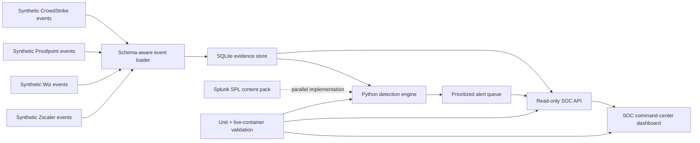

# Architecture

## Containers

The default Compose project has one least-privileged Python container and one named SQLite volume. The service uses only Python's standard library, minimizing software supply-chain surface and startup time.

## Trust boundaries

- Telemetry is untrusted and stored with an original JSON representation.
- Detection rules are deterministic; no model can directly create or close an incident.
- The dashboard is read-only and escapes untrusted fields before display.
- Validation reports synthetic mode explicitly to prevent vendor-certification claims.
- External APIs and real remediation are outside the default trust boundary.

## Production design extension

A production implementation should replace SQLite with a managed evidence store, add authenticated ingestion and RBAC, verify vendor schemas against authorized tenants, sign detection releases, integrate case management, retain immutable audit logs, establish SLAs, and independently validate alert closure.

